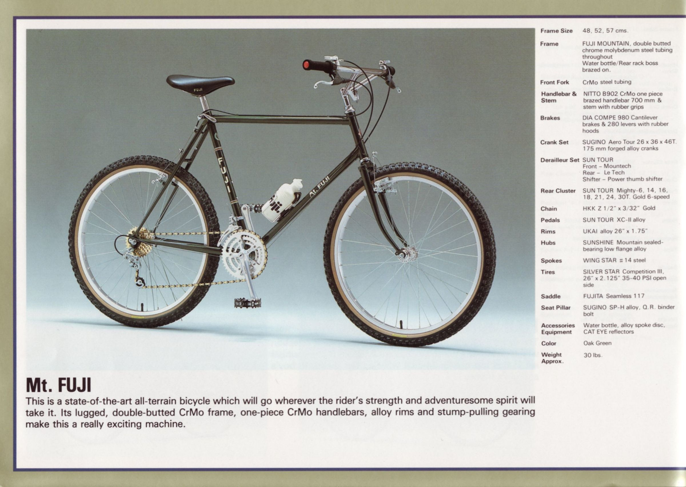

# Fuji Mt. Fuji

| Component | Spec |
| --------- | ---- |
| Frame & Fork | [1984 Fuji Mt. Fuji](https://classicfuji.posthaven.com/1984-fuji-catalog-no-14-edition) |
| Handlebar | [Fairweather x Nitto B903 Bullmoose Bar](https://global.bluelug.com/fairweather-b903-bullmoose-bar-silver.html) |
| Grips | [Cult Heavens Gate Grip (gum)](https://cultcrew.com/products/heavens-gate-grip?variant=32572410167381) |
| Stem | [Nitto threadless converter](https://global.bluelug.com/nitto-threadless-converter-silver.html) |
| Headset | Hatta Swan threaded headset |
| Brakes | Shimano CT91 Altus Cantilever Brakes |
| Cranks | Sugino MP 170mm 110 BCD |
| Chainring | [Wolf Tooth 34T 110 BCD Chainring](https://www.wolftoothcomponents.com/collections/chainrings/products/110-bcd-cyclocross-chainrings) |
| Bottom Bracket | Shimano sealed cartridge |
| Pedals | TBD |
| Derailleur | [Shimano RD-M5100 Deore 11 speed Derailleur](https://bike.shimano.com/en-US/product/component/deore-m5100/RD-M5100-SGS.html) |
| Brake Levers | [Dia-Compe SS6](http://www.diacompe.com.tw/product/ss6/) |
| Shifter | [Shimano SL-M5100 Deore 11 speed shifter](https://bike.shimano.com/en-US/product/component/deore-m5100/SL-M5100-L.html) |
| Cassette | [SunRace CSMX80 11sp Cassette 11-50T](https://bike.shimano.com/en-EU/product/component/ultegra-r8000/CS-HG800-11.html) |
| Rims | [Alex Adventure 2 TRS 26"](https://alexrims.com/products/adventurer2/) |
| Front Hub | [Shimano DH-3N72 Nexus Dynamo Front Hub](https://bike.shimano.com/en-US/product/component/deorelx-t670/DH-3N72.html) |
| Rear Hub | [Shimano FH-RS400 Tiagra 11 speed hub](https://bike.shimano.com/en-US/product/component/tiagra-4700/FH-RS400.html) |
| Tires | [Panaracer GravelKing SK TR 26x2.1"](https://www.panaracerusa.com/products/gravelking-sk-knobby-folding-gravel-tires) |
| Saddle | [WTB Volt 142mm](https://www.wtb.com/products/volt) |
| Seat Post | 26.4mm |

