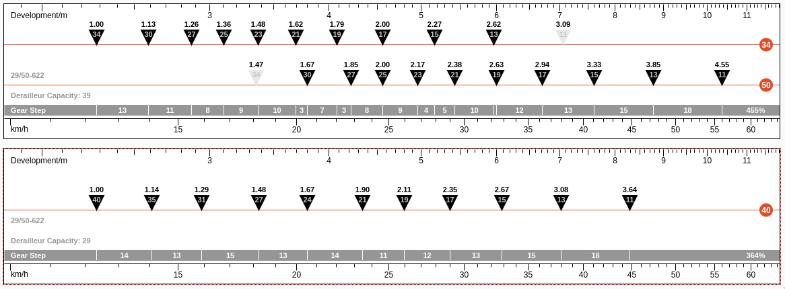

# moots routt 45

| Component | Stock | Wishlist |
| --------- | ----- | -------- |
| Frame | [Moots Routt 45, 54cm, etched titanium](https://moots.com/bike/routt-45/) | |
| Fork | [Moots gravel disc fork](https://moots.com/components/#forks) | ? |
| Handlebar | Fizik Cyrano R3 40cm | |
| Handlebar Wrap | Moots black | |
| Stem | Moots 90mm ti stem | |
| Headset | [Chris King I7 matte jet](https://chrisking.com/products/headset-inset-7?variant=8177170055213) | |
| Cables | Black | |
| Brakes | Ultegra R8020 hydraulic disc brakes | |
| Cranks | [Ultegra R8000 Compact Chainset 50/34T](https://bike.shimano.com/en-AU/product/component/ultegra-r8000/FC-R8000.html) | [Cane Creek eeWings All Road 170mm](https://canecreek.com/product/eewings-all-road/) |
| Chainrings | [Ultegra R8000 Compact Chainset 50/34T](https://bike.shimano.com/en-AU/product/component/ultegra-r8000/FC-R8000.html) | [Wolf Tooth SRAM Direct Link 40T Chainring](https://www.wolftoothcomponents.com/collections/gravel-cyclocross-road/products/direct-mount-chainrings-for-sram-cranks?variant=14781783474211#loaded) |
| Bottom Bracket | [Ultegra BBR60 68mm](https://bike.shimano.com/en-EU/product/component/105-5800/SM-BBR60.html) | [Chris King Threadfit 30](https://chrisking.com/collections/threadfit-30) with [Fit Kit #3](https://chrisking.com/collections/all-bottom-brackets/products/threadfit-30-bottom-bracket-fit-kits) |
| Pedals | SPD M520 | |
| Front Derailleur | Ultegra FDR8000 band on | None (1x) |
| Rear Derailleur | [Ultegra RX RD-RX800-GS](https://bike.shimano.com/en-EU/product/component/ultegra-rx/RD-RX800-GS.html) | [Ultegra RX RD-RX800-GS](https://bike.shimano.com/en-EU/product/component/ultegra-rx/RD-RX800-GS.html) with [Wolf Tooth RoadLink DM](https://www.wolftoothcomponents.com/products/roadlink-dm) |
| Shifter | Ultegra R8020 | |
| Cluster | [Ultegra CS-HG800-11 11-34T](https://bike.shimano.com/en-EU/product/component/ultegra-r8000/CS-HG800-11.html) | [SunRace CSMX8 EAX 11sp 11-40t](http://www.sunrace.com/en/products/detail/csmx8) |
| Wheelset | [Mavic Ksyrium Allroad Elite UST Disc](https://shop.mavic.com/en-int/allroad-elite-ust-disc-rr0974.html) | ? |
| Tires | [WTB Riddler 700x37c TCS tires](https://www.wtb.com/products/riddler700c) | ? |
| Saddle | Fizik Aliante R3 | |
| Seat Post | Moots cinch lay back ti post | |

## wider cranks

My knees hurt. A lot. After short distances.
I'm interested in shortening my crank arms and widening my stance to more
closely match the profile of my old Fuji.

| dimension | ultegra | eeWings |
| --------- | ------- | ------- |
| length | 172.5mm | 170mm |
| bb | Hollowtech II | BSA 68 / 30mm |
| chainline | 43.5mm | depends on chainring |
| q-factor | 146mm | 160mm |
| bcd | 110mm | 110mm |
| bolt pattern | 4 arm | 5 arm |

Making the switch will also require a new BSA 68 / 30mm bottom bracket.
The switch from Hollowtech II to a standard BSA 68 bottom bracket feels
like a good change either way.

I may also switch to a [new 1x gearing](https://www.gear-calculator.com/?GR=DERS&KB=34,50&RZ=11,13,15,17,19,21,23,25,27,30,34&UF=2281&TF=90&SL=2.6&UN=KMH&DV=ratio&GR2=DERS&KB2=40&RZ2=11,13,15,17,19,21,24,27,31,35,40&UF2=2281) at the same time.

## fork upgrade

I want a fork with similar or larger tire clearance, internal wiring for a
dynamo hub, and mount points for cages or panniers and a front light.

* [cargo forks](https://bikepacking.com/index/forks-with-bottle-cage-mounts/)
* headlight: [schmidt edelux II](https://nabendynamo.de/en/products/headlights/for-hub-dynamos/)

| fork | atc(mm) | rake(mm) | steerer | features |
| --- | ------- | -------- | ------- | -------- |
| [Moots](https://moots.com/components/#forks) | 395 | 47 | tapered | internal brake |
| [Rodeo Spork 3.0](https://www.rodeo-labs.com/shop/forks/rodeo-labs-spork-3-0/) | 396 | 45 | tapered | internal brake, dynamo, 2 bolts |
| [Whisky No. 9 MCX](https://whiskyparts.co/forks/no-9-mcx-fork) | 415 | 50 | tapered | internal dynamo, 3 bolts |
| [Bombtrack EXT V2](https://bombtrack.com/parts/forks/ext-fork-2-2/) | 398 | 48 | tapered | internal brake, dynamo, 3 bolts |
| [Curve GXR](https://www.curvecycling.com.au/collections/forks/products/fork-gxr-12mm-flat-mount) | 400 | 51 | tapered | internal brake, 3 bolts |
| [Cairn Adventure](https://www.cairncycles.com/products/cairn-adventure-fork) | 395 | 48 | tapered | internal brake, dynamo, 3 bolts |
| [Fyxation Sparta](https://www.fyxation.com/products/carbon-fiber-adventure-fork) | 400 | 45 | tapered | internal brake, 3 bolts |

## 650b wheels

I'm considering 650b wheels to address toe overlap and allow for running
larger tires.

* [wide gravel wheels](https://bikepacking.com/gear/wide-gravel-wheels/)
* [650b conversion](https://bikepacking.com/gear/700c-to-650b/)

### tires

* [WTB Byway](https://www.wtb.com/products/byway)
* [Panaracer Gravel King](https://www.panaracer.com/lineup/gravel.html)
* [Switchback Hill](https://www.renehersecycles.com/shop/components/tires/650b/650bx48-switchback-hill/)

### rims

* [Astral Outback](https://astralcycling.com/collections/dirt-rims/products/outback-rim)
* [Industry Nine](https://industrynine.com/wheels/mountain)

### hubs

* [Schmidt SON28](https://nabendynamo.de/en/products/hub-dynamos/for-thru-axles/)
* [Rohloff speedhub](https://www.rohloff.de/en/products/speedhub)
